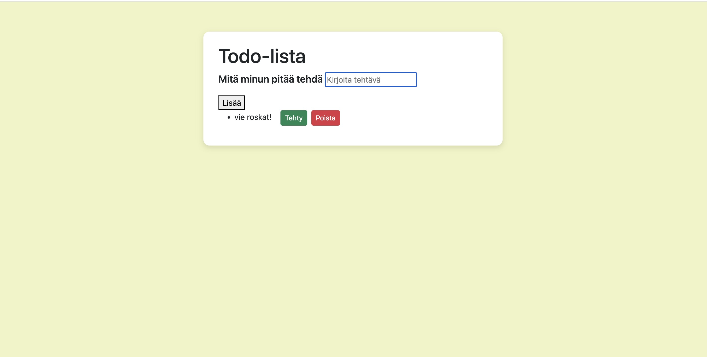

# Projektin nimi ja tekijät
Tämän projektin nimi on Projekti 1: DOM-skriptaus, tekijä: Oona Kärkkäinen

## Verkkolinkit:
Pääset julkaistuun sovellukseen käsiksi osoitteessa https://dom-skripti.netlify.app/

## Oma arvio työstä ja oman osaamisen kehittymisestä
Mielestäni onnistuin hyvin dom skriptauksessa.
Parantamista olisi: UI ja CSS olisi vielä parannettavaa. Bootstrappia voisi myös opetella käyttämään enemmän.
Sovelluksesta jäi puuttumaan tiedon tallennetaan selaimeen, esim. localstorageen.
Koen, että olen oppinut, kuinka julkaista Netlify palvelussa, sekä opin myös eri lisensseitä ja miten lisätään lisenssi omaan repoon. Opin myös miten lomakkeen rakenne toimii javascriptissä ja miten toimiva lomake rakennetaan. 
Epäselväksi jäi: en kerennyt katsoa miten Listan tiedot localstorageen
Antaisin itselleni pisteitä seuraavasti: 8 pistettä, toiminnallisuuksia olisi voinut olla enemmän, sekä parempi UI. 

## Palaute opettajalle kurssista sekä itse opetuksesta tähän saakka
Kurssi vaatii enemmän itsenäistä opiskelua, koska kokonaan verkkokurssi. Tämän myötä saatan jäädä joskus jälkeen aiheissa. 
Oppimistani tukisi jos muistetaan käydä läpi kaikki workshopit ja jos saisi palautetta, että mikä on mennyt vaikka väärin yms. 

## Sisällysluettelo:

- [Tietoja sovelluksesta](#tietoja-sovelluksesta)
- [Tunnetut virheet/bugit](#Tunnetut virheet/bugit)
- [Kuvakaappaukset](#kuvakaappaukset)
-[Teknologiat](#teknologiat)
- [Kiitokset](#kiitokset)
- [Lisenssi](#lisenssi)

## Tietoja sovelluksesta
Todo-lista on sovellus, joka kirjaa ylös käyttäjän haluamat tehtävät. Se antaa myös käyttäjän poistaa, lisätä ja yli viivata tehdyt tehtävät.

## Tunnetut virheet/bugit
En itse törmännyt bugeihin. 

## Kuvakaappaukset

## Teknologiat
Käytin projektissa HTMl, CSS ja JavaScriptiä. HTML:llä rakensin sovelluksen rakenteen, kuten otsikot, syötekentät, painikkeet ja tehtävälistan. CSS:llä muokkasin sovelluksen ulkoasua, kuten värejä, välejä, fontteja ja elementtien sijoittelua. JavaScriptillä toteutin sovelluksen toiminnallisuuden, esimerkiksi tehtävien lisäämisen, poistamisen ja merkitsemisen tehdyiksi.

## Kiitokset
-w3 schools(https://www.w3schools.com/)
-bootstrap (https://getbootstrap.com/)
-Mika Stenberg Web-sovelluksia Java Scriptin avulla
-Apuna käytetty myös ChatGpt, esimerkiksi: css tiedoston muokkaamiseen, sekä koodin virheiden korjaamiseen.  

## Lisenssi
 MIT-lisenssi @Oona Sofia (https://github.com/OonaSofia)